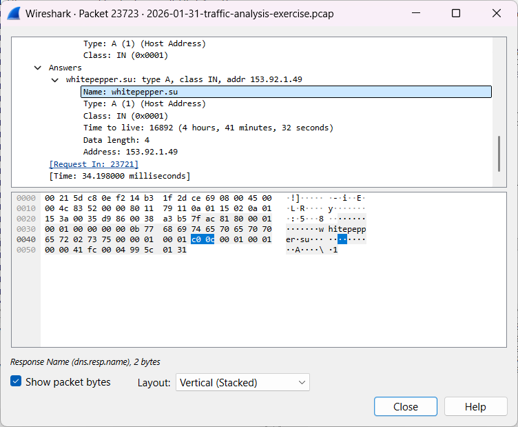
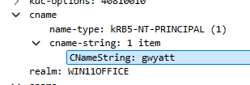

# 🔍 Lumma Stealer Traffic Analysis (SOC Project)

## 📌 Overview

This project demonstrates a real-world Security Operations Center (SOC) investigation using Wireshark to analyze malicious network traffic associated with Lumma Stealer malware.

---

## 🎯 Objective

* Identify the infected host
* Extract system and user information
* Detect malicious communication
* Perform packet-level analysis

---

## 🛠️ Tools Used

* Wireshark
* Network Traffic Analysis
* DNS & Kerberos Inspection

---

## 🔍 Key Findings

| Item             | Value             |
| ---------------- | ----------------- |
| Infected IP      | 10.1.21.58        |
| MAC Address      | 00:21:5d:c8:0e:f2 |
| Hostname         | DESKTOP-ES9F3ML   |
| Username         | gwyatt            |
| Full Name        | Grace Wyatt       |
| Malicious Domain | whitepepper.su    |

---

## 📸 Evidence

### 🖥️ Host Identification (DHCP)

### 🌐 Malicious Domain (DNS)

### 👤 User Identification (Kerberos)

---

## 🧠 Skills Demonstrated

* Network Traffic Analysis
* Threat Hunting
* IOC Identification
* Incident Investigation
* Protocol Analysis (DNS, DHCP, Kerberos)

---

## 📄 Full Incident Report

See `incident-report.md`

---

## 🚀 Outcome

Successfully identified a compromised host and associated user communicating with a known malicious domain linked to Lumma Stealer malware.

---
